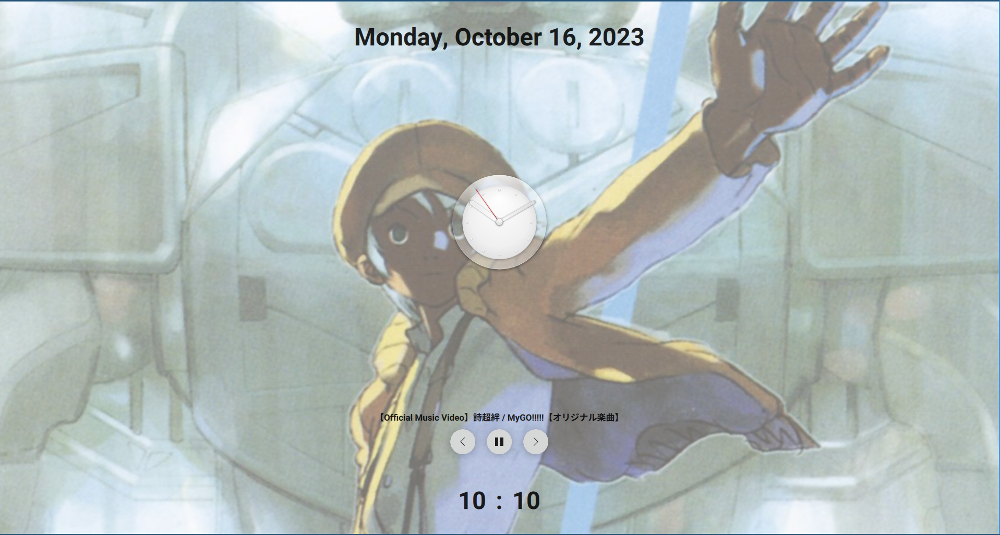

# WayCrateLock

session-lock-v1 with qml

## Toy project -- till now
Support mpris, current only works on sway

Base on [qt-session-lock](https://github.com/waycrate/qt-session-lock)

## Help needed

The password text field only can input on the first screen registed, I think the problem is in qt-session-lock, the qt binding for session-lock-v1, but I cannot handle it.

## View

