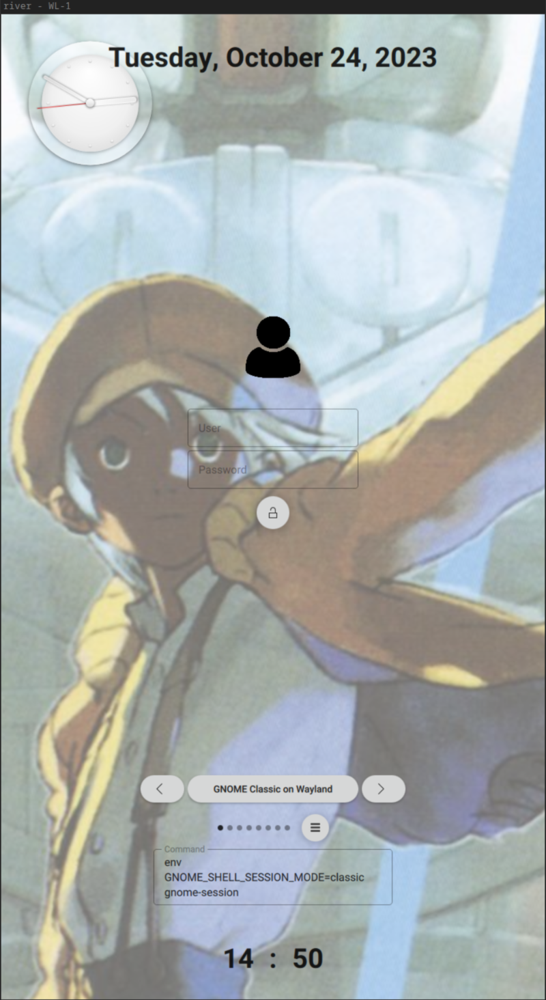

# QML greetd dm

[](https://repology.org/project/greetd-waycratedm/versions)

Base on [qt-session-lock](https://github.com/waycrate/qt-session-lock) and greetd, take a lot of reference from qtgreetd

## Install

from aur:

```bash
paru -S greetd-waycratedm
```

You can set exec alias (most for gnome, which start way is not the same in desktop, and for sway, if you use nvidia).

And can set environment variables for every desktop. Like sway, which need to set `XDG_CURRENT_DESKTOP`, and gnome, who won't set `XDG_SESSION_TYPE` for you. This variables only setted when you enter this desktop, but you do not want to set these for others, you can try this project.

The package of waycratedm will create a user called `marine_greeter`, who has a home under /var/lib/marine, You need to let greetd start waycratedm with that user, then it can work in good, way, and you can also start it with user like `sddm` or `gdm` who already has its home.

## Example config

```toml
[terminal]
# The VT to run the greeter on. Can be "next", "current" or a number
# designating the VT.
vt = 1

# The default session, also known as the greeter.
[default_session]

# with whatever you want started, such as `sway`.
command = "river -c waycratedm"

# The user to run the command as. The privileges this user must have depends
# on the greeter. A graphical greeter may for example require the user to be
# in the `video` group.
user = "marine_greeter"

```

## View

